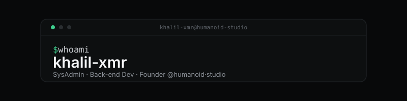

&nbsp;

&nbsp;

## About

`$ whoami`

- SysAdmin by trade, back-end dev by choice — running infrastructure and shipping software since 2022
- Founder of **humanoid·studio** — web agency · Web2/3 · e-commerce · open to missions
- Daily stack: Python · Node.js · Docker · Linux · MongoDB · REST APIs
- Based in Thailand · Freelance remote since 2023

## What I'm Working On

<table>
  <tr>
    <td align="center" width="60">🌿</td>
    <td><strong><a href="https://ecologiclife.fr">EcologicLife</a></strong></td>
    <td>Eco-responsible web platform for an active client — Node.js full-stack, REST API, MongoDB.</td>
  </tr>
  <tr>
    <td align="center" width="60">⬡</td>
    <td><strong><a href="https://humanoidstudio.com">humanoid·studio</a></strong></td>
    <td>Web agency launching soon — Web 2.0 sites, Web3/DApps, e-commerce stores, SysAdmin services.</td>
  </tr>
</table>

## Services @ humanoid·studio

## Tech Stack

**Dev & Back-end**

**Infra & Ops**

**ITSM & Security**

## GitHub Stats

## Contribution Activity

---

Made with ❤️ &nbsp;·&nbsp; Thailand 🇹🇭 & France 🇫🇷 &nbsp;·&nbsp; Open to freelance missions

